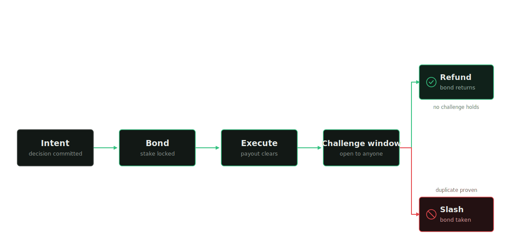
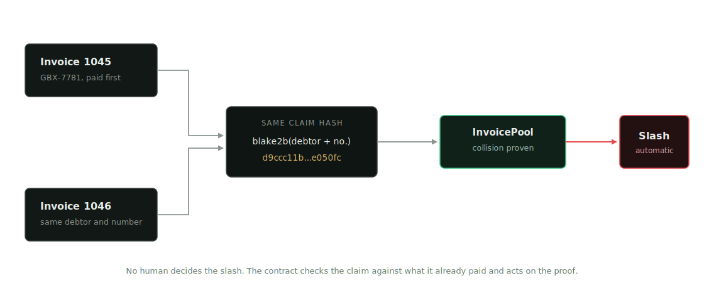
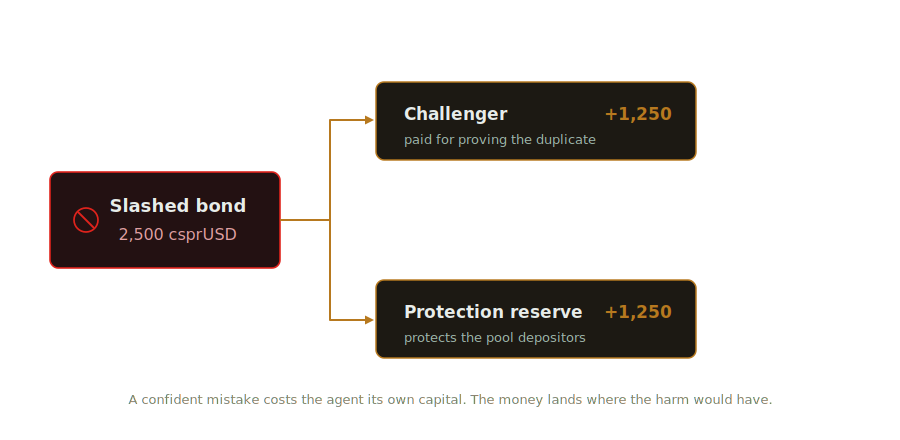
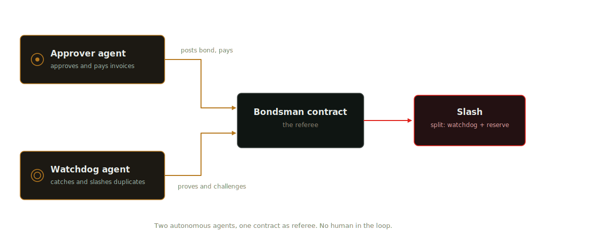
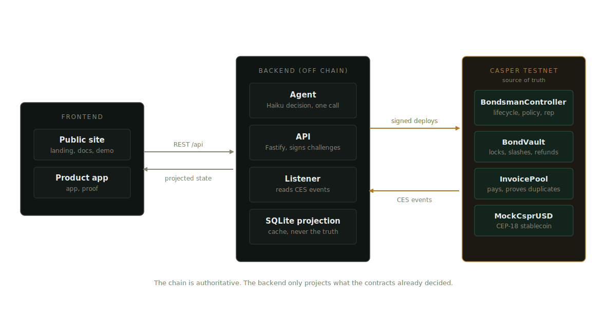

# Bondsman

**An on-chain accountability layer for autonomous finance agents on Casper.**

Bondsman forces an autonomous agent to post a slashable bond before it can move tokenized capital. If the agent's action is later proven wrong, the contract slashes the bond automatically. No committee, no appeal, no human judgment. If the action holds up, the bond is refunded in full and the agent's on-chain reputation improves.

Live on Casper Testnet. Every bond, every slash, every refund is a real transaction, verifiable on the public explorer.

---

## The problem

Autonomous agents are being handed the keys to DeFi vaults and tokenized asset pools. An agent can approve a payout in milliseconds. Today, if it is wrong, whether from a hallucination, a stale input, or an outright duplicate, the loss lands on depositors, and the agent risks nothing.

Bondsman closes that gap. It makes an agent stake real capital before it can act, so a confident mistake has a cost, and that cost lands exactly where the decision was made.

## The use case: paying invoices, without paying twice

An agent processing accounts payable approves invoices for payment. The expensive, common failure is paying the same invoice twice: a duplicate slips through and the money is gone.

Bondsman gives every invoice a claim hash, a fingerprint of what it claims. When a payout reuses a fingerprint that was already paid, the contract proves the duplicate and slashes the bond. The agent loses its own stake before anyone else loses a cent.



Every bonded action follows the same path: an agent commits its reasoning and initiates the action, locks a risk-weighted bond, executes the payout, and opens a challenge window. It ends one of two ways: the bond returns, or the bond is taken.

---

## The contract proves the fraud, nobody judges it

No human decides a slash. Each invoice carries a claim hash, `blake2b(debtor + invoice_number)`. When a payout reuses a hash that was already paid, the pool contract sees the collision and the slash follows automatically. It is a fact the chain can verify, not a verdict someone renders.



When a bond is slashed, it splits: half rewards whoever proved the fault, half funds a protection reserve that backstops the pool's depositors.



A confident mistake costs the agent its own capital. The money lands where the harm would have.

---

## Two autonomous agents, one contract as referee

Bondsman runs two agents against each other, with no human in the loop:

- **The approver** is model-driven. It reviews an invoice with a language model (Claude Haiku), decides whether to approve it, and commits a hash of its reasoning on chain before it acts. It can be wrong, and confidently so, because it sees only the invoice in front of it, exactly what a real payout agent sees in production.
- **The watchdog** is deterministic. It has its own funded Casper account, independently detects duplicate claims by comparing on-chain fingerprints, and autonomously challenges and slashes them, earning the reward itself. It never sleeps and it never asks permission.



Anyone can also challenge a bad payout by hand: connect a Casper wallet, inspect the evidence, sign the challenge, and the reward goes to that wallet. A backend-signed fallback exists for a frictionless demo path when a wallet is not connected; it is labeled honestly and the reward in that case goes to the demo key, not the visitor.

---

## Architecture



- **Smart contracts** (Rust, Odra framework, compiled to WASM, deployed on Casper Testnet):
  - `MockCsprUSD`, a CEP-18 testnet stablecoin used for bonds and payouts.
  - `BondVault`, custodies bonds, refunds clean ones, and splits a slash between the challenger and the reserve.
  - `BondsmanController`, owns the action lifecycle, the risk-weighted bond calculation, agent reputation, and challenge resolution.
  - `InvoicePool`, stores invoices, pays vendors, records the first paid claim per fingerprint, and proves duplicates on chain.
- **Backend** (TypeScript): a Fastify API, an event listener that projects Casper Event Standard events into SQLite, the approver agent runner, the watchdog daemon, and a demo-arming service that keeps the product always ready to try.
- **Frontend** (Next.js, TypeScript, Tailwind): the public site and the app, including the Challenge Arena, the action Docket, My Ledger, the Agents directory, and the Leaderboard.
- **MCP server**: exposes Bondsman's core actions (get action, get reputation, get the required bond, challenge an action, read deployments) as tools any Casper agent can call directly, so bonded accountability is adoptable infrastructure, not just a demo.

### The bond and reputation

The required bond scales with the size of the payout, and rises further if the agent's on-chain reputation is negative. A clean action adds to reputation; a slash subtracts far more. The bond floor by amount tier never discounts below the base rate, so there is no way to grind a good reputation on small actions and then defect on a large one.

### Current testnet deployment

Bondsman is deployed as a live Casper Testnet prototype with real on-chain execution. The core accountability loop is active today: agents post bonds, payouts execute through the invoice pool, duplicate claims can be challenged, bonds can be slashed, reserves update, and agent reputation changes on chain.

The invoice dataset uses controlled testnet fixtures so duplicate-claim scenarios can be reproduced safely and consistently during demos. The stablecoin is a testnet CEP-18 asset, and the x402 verification flow is implemented as a metering sandbox for future paid verification. The production path is direct: connect a real invoice/oracle feed, replace the testnet token with a production asset, and connect x402 settlement to a facilitator-compatible payment flow.

---

## Live deployment (Casper Testnet)

| Contract | Address |
|---|---|
| BondsmanController | `hash-6f1e1b47040f8b90f73b4bb7b8cc6303a18ae09b628fc4870c14eb6250303a2b` |
| BondVault | `hash-80e67ef6955e1a5734168c109e18def082c596cc58dba87f50ab523bfe042db6` |
| InvoicePool | `hash-ada888facd119474d3fb5271f23e403aa7bc033b87def9945e1aa6b2906a0b0a` |
| MockCsprUSD | `hash-410af53a3a93196081eb3b8c7dafab120efeed826b30b23cbed3873203709668` |

The canonical, up-to-date set lives in `deployments/testnet.json`, since contracts may be redeployed as the product evolves. Every address above is a live link on `testnet.cspr.live`.

---

## MCP: integrate bonded accountability into your own agent

Bondsman exposes an MCP server so any Casper agent can check reputation, price a bond, or challenge a bad action without reading the contracts directly.

Published on npm: **[@vinaystwt/bondsman-mcp](https://www.npmjs.com/package/@vinaystwt/bondsman-mcp)**

```bash
npm install -g @vinaystwt/bondsman-mcp
bondsman-mcp
```

Tools exposed: `get_action`, `list_actions`, `get_reputation`, `get_bond_requirement`, `get_deployments`, `challenge_action`. See `mcp-package/` for source and a runnable example.

---

## Roadmap

- **Q3 2026.** Harden the bond and slash logic through external review. Replace the testnet stablecoin with live csprUSD. Sign a first design partner running a real invoice or private credit pool on Casper.
- **Q4 2026.** Agent operator tools and a proof center. The x402 metered verification path documented for real service integration.
- **Q1 2027.** An underwriting and policy layer: reserve analytics, policy templates for challenge windows and risk tiers, and a portable agent reputation passport other Casper protocols can read.
- **Q2 2027 and the mainnet path.** Production contracts with production csprUSD, oracle backed delivery attestation, x402 settlement once the token and facilitator support production payments, and reputation APIs for integrators.

Full detail on the [roadmap page](https://bondsman.vercel.app/roadmap).

---

## Running it locally

```bash
git clone https://github.com/vinaystwt/bondsman
cd bondsman
npm install

# Backend
npm run build:contracts   # already deployed; only needed if you redeploy
npm run api               # Fastify API on :3001
npm run listener          # projects on-chain events into SQLite
npm run watchdog          # the autonomous watchdog agent

# Frontend
cd frontend
npm install
npm run dev                # :3000, proxies to the local API
```

Copy `.env.example` to `.env` and fill in your own testnet keys and an Anthropic API key for the approver agent. See `deployments/testnet.json` for the live contract addresses this repo already targets.

## Live demo

[bondsman.vercel.app](https://bondsman.vercel.app)

The hosted frontend requires the backend to be reachable at the URL set in `NEXT_PUBLIC_API_BASE`. See the deployment notes in the repository for how the backend is hosted for the public demo.

---

## License

MIT
